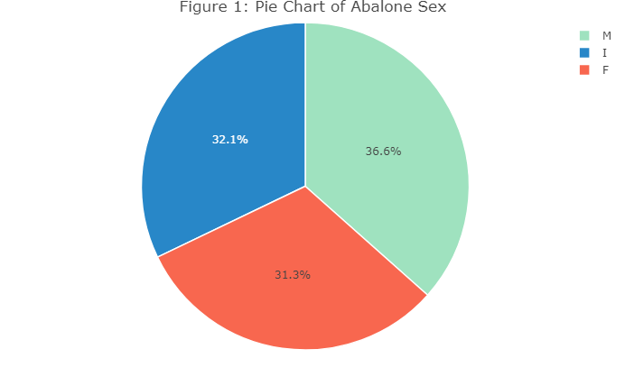

# Introduction

Abalone are classified as marine gastropod molluscs, and are also known as marine snails. They have a worldwide distribution, but are mostly found off the coasts of New Zealand, South Africa, Australia, Western North America, and Japan. In this study, samples of Abalone are taken from Islands near Tasmania. The data includes physical characteristics of 1477 stunted blacklip abalone. The traits recorded are as follows:

 - Sex: Male (M), Female (F), and Infant (I)
 - Length: longest shell measurement (mm)
 - Diameter: perpendicular to length (mm)
 - Height: with meat in shell (mm)
 - Whole weight: whole abalone (g)
 - Shucked weight: weight of meat (g)
 - Viscera weight: gut weight after bleeding (g)
 - Shell weight: after being dried (g)

Sex is a categorical variable while the other variables are all quantitative, hence we will make sure to declare Sex as a factor when building our model. The purpose of this study is to make determining the age of abalone more efficient for researchers. The current method for determining the age of an abalone is cutting the shell through the cone, staining it, and counting the number of rings through a microscope. This process is very tedious and time consuming. Determining each of the physical parameters above would also be an inefficient process, so the goal is to produce a model that requires the fewest number of predictors while also remaining significant.
Abalone are researched for various reasons: risk of extinction, abalone farming, and their ecological importance in controlling algal density and supporting diversity of kelp species. Due to illegal harvesting, disease, and low reproduction rates, abalone populations are on the decline. There are various researchers around the world, including Dr. Kristin Aquilino of the UC Davis Bodega Bay Marine Laboratory, working on restoring the world’s abalone population. Abalone are not only responsible for supporting kelp forests, but are also a significant contributor to the economy of many countries, including South Africa (NOAA).

# Methods and Results 

## Exploratory Data Analysis 

In order to gain a better understanding of the data, we first created histograms for the quantitative variables and a pie chart for our one qualitative variable (Appendix 1, Figures 1-8). We can see that length is left-skewed with a mean of 0.524mm and a median of 0.545mm. Diameter has a similarly shaped distribution with a mean of 0.408mm and a median of 0.425mm. The height variable has a very narrow distribution with a slight left skew with a mean of 0.1395 and a median of 0.14. Each of the weight variables has a fairly similar distribution that is mildly right skewed. Whole weight has a larger spread with a mean of 0.829g and a median of 0.7995g. Shucked weight has a mean of 0.359g and a median of 0.336g. Viscera weight has a mean of 0.181g and a median of 0.171g. Lastly, shell weight has a mean of 0.239g and a median of 0.234. The response variable, rings, is also plotted. We can observe a distribution that is right skewed with a mean of 9 and a median of 9.933 (Appendix 1, Figure 9).

Due to many of the variables being related to weight, we had a hunch that there would be a high level of multicollinearity in the data. Hence, we examined the correlation values between each of the variables, as well as variance inflation factors (VIF). As can be seen in the correlation plot (Appendix 1, Figure 10), many of the variables have a correlation coefficient value greater than 0.9. Length and diameter have a correlation coefficient of 0.99, hinting that we will later need to disregard one of these variables in our final model. Further, these two variables being highly correlated is fairly intuitive since abalone are fairly round and consistent in shape. The VIF values are as follows: Sex- 1.543, Length - 40.946, Diameter - 42.380, Height - 3.581, Whole.weight - 109.769, Shucked.weight - 28.551, Viscera.weight - 17.445, Shell.weight - 21.263. Any VIF value greater than 10 suggests high multicollinearity, and many of the VIF values far exceed this value. Discovering this high level of multicollinearity will help guide our model-building process.


## Checking Model Assumptions 

Our first step of building a predictive model is ensuring that we meet the assumptions to build a proper model. We check that we do not violate homoscedasticity via a Residuals vs. Fitted Values plot. We see no obvious sign of a pattern, so we can conclude that we have no heteroscedasticity (Appendix 1, Figure 11). We also must check the normality of our residuals with a Normal Quantile-Quantile plot (Appendix 1, Figure 12). Upon plotting, we immediately observe that our residuals are right skewed, as hinted by the histogram of our response variable, Rings. From here, a Box-Cox transformation was performed on an initial full model to find the optimal transformation for our response variable. Suggested from a 95% confidence interval (Appendix 1, Figure 14) that a lambda value equal to zero would be optimal, we performed a log transformation on our response variable and then reassessed our assumptions. Our new log-linear model provides much stronger evidence for approximate normality in our residuals, allowing us to carry on with our analysis. The slight caveat however, we do have two outliers that skew that approximation of normality, observation 237 and 2052. 

These two observations have extremely large residuals, relative to the rest of the data. Along with that, a plot of our residuals vs. leverage plot shows us that the Cook’s distance (Appendix 1, Figure 13) for observation 2052 is nearly 500 times larger than the rest of the points. Investigating these two points, we first recognize observation 237, which is a very young and tiny abalone, much younger and smaller than the majority of infant abalones in our data. Observation 2052 however, is an extremely tall and heavy female abalone, relative to other females in the data. Due to these influential observations, we will remove them from the data, as to not skew our predictability. 


## Model Selection 

Now that we have made clear that our assumptions for the building of a linear model are met, as well as removing influential points, we then switch our focus to the quality of the predictors in the model. A general F-test tells us that our model is highly significant at any reasonable alpha. A t-test for each predictor coefficient shows us that the dummy variable of male sex is not significant, despite the observation that sex being an infant is a highly significant piece of information for the model. Due to this, we create a new dummy variable; one which only will provide us information about whether the abalone is an infant or an adult. 

The next issue faced was the challenge of multicollinearity, as seen in the exploratory data analysis, which is persistent throughout the variables in our data. Due to this, we first try to remove shucked weight from our prediction, given that it’s correlated with whole weight at a Pearson correlation coefficient of 0.97. Using this logic, we also removed viscera weight, shell weight, and length, whose correlation coefficient with diameter was 0.99. Combining this with our new infant variable in hopes of  a simpler model, we find that our adjusted R squared value shrinks by about 0.09, leaving us to infer there is room for improvement. 

Changing direction, we switched to a ridge regression model, which would allow us to observe which variables should be shrunk due to the penalization of an L2 norm. We first find an optimal lambda value for our ridge model and observe our coefficients. We observe that the smallest coefficient is whole weight, with infant, length, and viscera weight not far behind. Despite this, we decided to approach a new model suggested by our ridge regression with the deletion of the whole weight first. This new, significant model shows us that all but viscera weight are significant, so we update once more to a model that only includes Infant status, length, diameter, height, shucked weight, and shell weight. 

Treating this as a new full model, we then perform forward stepwise selection on sub-models based on AIC and BIC criterion. Our stepwise regression based on AIC suggests the AIC lowers with all variables except length. BIC, in further support, increases when length is left in the model. This positive result allows us to further justify removing length from the model as we did earlier, recalling that the correlation between length and diameter was near one. 

We perform our stepwise regression one more time, with both AIC and BIC criterion, on our length-less model. In both iterations, we indeed find that the model with height, shell weight, shucked weight, diameter, and infant status is the best model to predict the log of rings based on the mentioned criterion. This model also provides us with an adjusted R squared of 0.5956, which is near the highest we have seen, while also being simplified and reducing multicollinearity. We have one final component to add and expand our model, interactions. 

We test all interactions with our remaining variables as listed in the previous paragraph. Individual t-tests tell us interactions such as shucked weight and height as well as shell weight and infant are non-significant. We reduce the model to find by the same process that the interaction between diameter and and our infant variable is non-significant. We then perform a stepwise selection just as before, using the AIC and BIC criterion. Finally we are left with a model containing height, shell weight, shucked weight, diameter, infant, and interactions between the following: height and diameter, shucked weight and diameter, and shucked weight and infant. With our new model reporting an adjusted R squared of 0.6273, we see an obvious improvement from our previous 0.5956. Here, we decide that these variables are the best set of predictors to be our final model.

## Model Interpretation 

Before interpreting the model, we first need to keep in mind that the response variable underwent a log transformation, hence care needs to be taken in understanding how changes in the predictor variables affect the value we want to predict, which is the number of rings. The final model equation is as follows: 
$$
\begin{aligned}
\hat{Y}_{Rings} = 0.919 + 11.076_{Height} - 2.256_{Shucked.weight} + 1.676_{Shell.weight} + 2.548_{Diameter} - 0.201_{Infant}\\  - 21.144_{Height:Diameter} + 2.810_{Shucked.weight:Diameter} + 0.447_{Shucked.weight:Infant} 
\end{aligned}
$$

The model indicates that diameter, height, and shell weight are all positively related to the log number of rings. Additionally, the interaction terms of shucked weight/diameter and shucked weight/infant are positively correlated to the response variable. Since y = log(x) is a monotone increasing function, this means that each of these variables is also positively related to the number of rings. Infancy and shucked weight are both negatively related to the number of rings. The height/diameter term is also negatively correlated to the response variable. Intuitively, the relationship between infancy and the response variables makes sense. Being an infant means that you are younger and hence will have fewer rings than adult abalone. The shucked weight variable is more open to interpretation. One could hypothesize that younger abalone tend to eat more since they are still growing and developing. Hence, if they consume more, their shucked weight should be greater. 

We have three interaction terms in the model. The first suggests that height has a different effect on the number of rings based on the diameter of the abalone. A similar interpretation can be made for shucked weight and varying values of diameter. The influence of shucked weight is further explained by if the abalone is an infant or not. If the abalone is an infant, the infant variable evaluates to 1 and shucked weight has an increased effect on the predicted value for the number of rings.

# Conclusion and Discussion 

Throughout the model building process, we determine that a linear model including some interaction terms provides the best fit for our data. We also determined that the data has high levels of multicollinearity and accounted for this obstacle via Ridge regression. With this, we determined that many of the variables did not need to be included in our model. Overall, we believe our final model for the age of stunted blacklip abalone is the best we can build given the parameters. However, we would like to identify a few places where we could have improvements. For instance, we are only given abalone data from one specific region. We would be curious to test this model with populations from abalone regions all around the world and compare. Similar in theme, we would also like to have more data available on different species of abalone outside of the stunted abalone. Regarding the abalone in this data, we would also be curious to see how other factors account for age. Perhaps older abalone have a different diet than those who are younger. Older abalone might be collected in different regions of coastline than younger ones. Lastly, how has the abalone population changed over time? Can we find data that is available from past abalone populations to compare in microevolutions over time? Answering these questions, we believe, is key to improving our predictions of collect abalone age. For now, we have created a linear model that only requires a few pieces of physical data, making it easier for researchers and scientists to determine the number of rings on an abalone shell.

# Appendices 

## Appendix 1 

```{r, echo = F, message = F}
library(ggplot2)
library(GGally)
library(plotly)
library(ggcorrplot)
library(car)
library(gridExtra)
library(MASS)
library(glmnet)

aba <- read.table("abalone.txt", sep = ",")
# Fixing Column names 
names(aba) <-
  c(
    "Sex",
    "Length",
    "Diameter",
    "Height",
    "Whole.weight",
    "Shucked.weight",
    "Viscera.weight",
    "Shell.weight",
    "Rings"
  )

# Change Sex into factor 
aba$Sex <- as.factor(aba$Sex)

### VISUALIZATION 

# Custom Colors 
colors <- c("#f8674f", "#2887c8", "#9fe2bf")
```

```{r pie, echo = FALSE, out.width='90%'}

```

```{r, echo = FALSE, message = F, fig.height=10}

#Histrogram of Length
fig2 <-
  ggplot(data = aba, aes(x = Length)) + geom_histogram(fill = "darkseagreen1",) + labs(title = "Figure 2")

fig3 <-
  ggplot(data = aba, aes(x = Diameter)) + geom_histogram(fill = "darkseagreen2") + labs(title = "Figure 3")


fig4 <-
  ggplot(data = aba, aes(x = Height)) + geom_histogram(fill = "darkseagreen3", bins =
                                                         100) + labs(title = "Figure 4")

fig5 <-
  ggplot(data = aba, aes(x = Whole.weight)) + geom_histogram(fill = "darkseagreen4") + labs(title = "Figure 5")

fig6 <-
  ggplot(data = aba, aes(x = Shucked.weight)) + geom_histogram(fill = "darkseagreen") + labs(title = "Figure 6")

fig7 <-
  ggplot(data = aba, aes(x = Viscera.weight)) + geom_histogram(fill = "darkseagreen1") + labs(title = "Figure 7")

fig8 <-
  ggplot(data = aba, aes(x = Shell.weight)) + geom_histogram(fill = "darkseagreen2") + labs(title = "Figure 8")

fig9 <-
  ggplot(data = aba, aes(x = Rings)) + geom_histogram(bins = 29, fill = "darkseagreen3") + labs(title = "Figure 9")

grid.arrange(fig2,
             fig3,
             fig4,
             fig5,
             fig6,
             fig7,
             fig8,
             fig9,
             nrow = 4,
             ncol = 2)
```


```{r, echo = FALSE, fig.height = 9}
# Scatter plot of Diameter, Rings, and Sex with plotly
# ggplot(data = aba, aes(x = Diameter, y = Rings, color = Sex)) + geom_point() + scale_color_manual(values = c("#f8674f", "#2887c8", "#9fe2bf")) + labs(title = "Figure 10")

corMat <- cor(aba[, -1])

ggcorrplot(
  corMat,
  type = "lower",
  outline.col = "white",
  lab = TRUE,
  color = c("#f8674f", "#2887c8", "#9fe2bf")
) + labs(title = "Figure 10")
```
\newpage 

**Figure 11, 12, 13** 

```{r, echo = F, fig.height = 4.3}

par(mfrow = c(2,2))

# Initial Model 
fullMod <- lm(Rings ~ ., data = aba)

### Checking Assumptions
plot(fullMod, which = c(1, 2, 5))

# Check for transformation 
boxcox(fullMod)
mtext("Figures 11, 12, 13, 14",side=3,line=-13,outer=TRUE)
#vif(fullMod)
# Now we use full log model
logFullMod <- lm(log(Rings) ~ ., data = aba)
plot(logFullMod, which = c(1, 2, 5))
mtext("Figures 15, 16, 17",side=3,line=-13,outer=TRUE)
```

## Appendix 2

```{r}
library(ggplot2)
library(GGally)
library(plotly)
library(ggcorrplot)
library(car)
library(gridExtra)
library(MASS)
library(glmnet)

aba <- read.table("abalone.txt", sep = ",")
# Fixing Column names 
names(aba) <-
  c(
    "Sex",
    "Length",
    "Diameter",
    "Height",
    "Whole.weight",
    "Shucked.weight",
    "Viscera.weight",
    "Shell.weight",
    "Rings"
  )

# Change Sex into factor 
aba$Sex <- as.factor(aba$Sex)

# Initial Model 
fullMod <- lm(Rings ~ ., data = aba)

# Now we use full log model
logFullMod <- lm(log(Rings) ~ ., data = aba)

vif(fullMod)

# Now we use full log model
logFullMod <- lm(log(Rings) ~ ., data = aba)
summary(logFullMod)


# We will drop observations 237 and 2052 since 
# it is harming our assumption of normality in residuals
aba <- aba[-c(237, 2052), ]

# Male sex is insignificant, so lets make new column where 
# abalone is infant or not
aba$Infant <- as.factor(ifelse(aba$Sex == 'I', 'Y', 'N'))

# Clean model by removing Length, and Viscera weight
redMod <-
  lm(log(Rings) ~ Infant + Diameter + Height + Whole.weight, data = aba)
summary(redMod)
```

```{r}
### RIDGE REGRESSION
fullMod <- lm(Rings ~ ., data = aba)
logMod <- lm(log(Rings) ~ ., data = aba)

guess <-
  lm(
    log(Rings) ~ Infant + Diameter + Height + Whole.weight + Shucked.weight +
      Shell.weight,
    data = aba
  )

response <- aba$Rings
predictors <-
  data.matrix(aba[, c(
    "Infant",
    "Length",
    "Diameter",
    "Height",
    "Whole.weight",
    "Shucked.weight",
    "Viscera.weight",
    "Shell.weight"
  )])

ridgeModel <- glmnet(predictors, response, alpha = 0)

cv_model <- cv.glmnet(predictors, response, alpha = 0)
best_lambda <- cv_model$lambda.min

best_model <-
  glmnet(predictors, response, alpha = 0, lambda = best_lambda)
coef(best_model)
```

```{r}
# Model suggested by ridge regression in mine.RMD, took out whole weight
ridgeSug <-
  lm(
    log(Rings) ~ Infant + Length +  Diameter + Height + 
      Shucked.weight + Viscera.weight + Shell.weight,
    data = aba
  )
#summary(ridgeSug)

# Lets drop viscera weight
ridgeSug <-
  lm(log(Rings) ~ Infant  + Length +  Diameter + Height + 
       Shucked.weight + Shell.weight,
     data = aba)
summary(ridgeSug)

# Stepwise Regression
nullModel <- lm(log(Rings) ~ 1, data = aba)
fullModI <- lm(log(Rings) ~ . - Sex, data = aba)
```

```{r, echo = FALSE, eval = FALSE}
AICstair <-
  stepAIC(
    nullModel,
    scope = list("lower" = nullModel , "upper" = ridgeSug),
    direction = "forward",
    k = 2,
  )

BICstair <-
  stepAIC(
    nullModel,
    scope = list("lower" = nullModel , "upper" = ridgeSug),
    direction = "forward",
    k = log(nrow(aba)),
  )
```

```{r}
# Length is the last to be added via step AIC, as well 
# as it is highly correlated with variables (diameter = 0.99), we will drop
# BIC also suggests we drop Length 
postStepModel <-
  lm(log(Rings) ~ Infant + Diameter + Height + Shucked.weight + Shell.weight,
     data = aba)
summary(postStepModel)
```

```{r, echo = FALSE, eval = FALSE}
# Test with stepAIC once more 
AICstair2 <-
  stepAIC(
    nullModel,
    scope = list("lower" = nullModel , "upper" = postStepModel),
    direction = "forward",
    k = 2,
  )

BICstair2 <-
  stepAIC(
    nullModel,
    scope = list("lower" = nullModel , "upper" = postStepModel),
    direction = "forward",
    k = log(nrow(aba)),
  )
```

```{r}
# Reducing the abalone dataset
aba_red <-
  aba[, c("Height",
          "Shucked.weight",
          "Shell.weight",
          "Diameter",
          "Infant",
          "Rings")]
head(aba_red, 10)

# Now we build a model with all our variabels and interactions
intModel <- lm(log(Rings) ~ . ^ 2, data = aba_red)
summary(intModel)

# Drop all non-signicant variables: height:shucked weight, height:infant,
# shucked.weight:shellweight, shell.weight:infant

intModel.red <-
  lm(
    log(Rings) ~ Height + Shucked.weight + Shell.weight + Diameter + Infant + 
      Height:Diameter + Shucked.weight:Diameter + Shucked.weight:Infant + 
      Diameter:Infant,
    data = aba_red
  )
summary(intModel.red)

# Removing non significant variable Diameter:Infant
intModel.red <-
  lm(
    log(Rings) ~ Height + Shucked.weight + Shell.weight + Diameter + Infant + 
      Height:Infant + Height:Diameter + Shucked.weight:Diameter + 
      Shucked.weight:Infant,
    data = aba_red
  )
summary(intModel.red)
```

```{r, echo=FALSE, eval = FALSE}
cat("\n Checking AIC now \n")
# AIC step with interactions 
AICstair3 <-
  stepAIC(
    nullModel,
    scope = list("lower" = nullModel , "upper" = intModel.red),
    direction = "forward",
    k = 2,
  )

cat("\n Checking BIC now \n")
# BICstepwise with int 
BICstair3 <-
  stepAIC(
    nullModel,
    scope = list("lower" = nullModel , "upper" = intModel.red),
    direction = "forward",
    k = log(nrow(aba)),
  )
```

```{r}
# BIC suggests we drop interaction between height:infant 
intModel.final <-
  lm(
    log(Rings) ~ Height + Shucked.weight + Shell.weight + Diameter + Infant+ 
      Height:Diameter + Shucked.weight:Diameter + Shucked.weight:Infant,
    data = aba_red
  )
summary(intModel.final)
```
